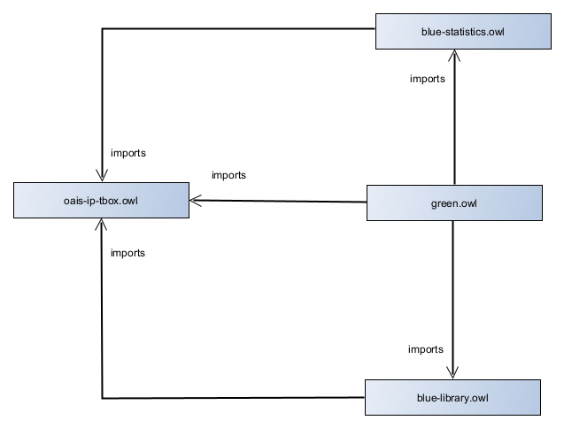
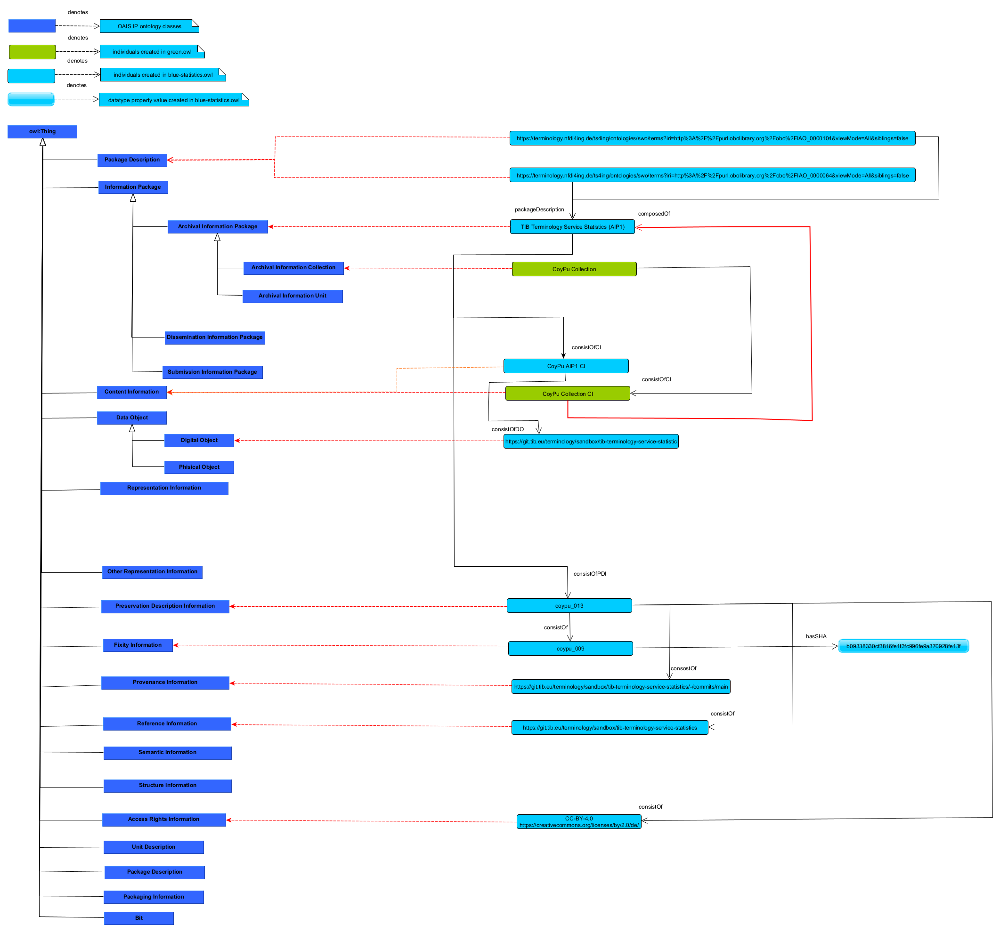

# OAIS IP Ontology Project

This project structure includes:

- Folder **tbox** that contains:
  - The **oais-ip-tbox.owl** file that is OAIS IP ontology schema.
- Folder **abox** that contains three sets of individual assertions stored in the following ontology files:  
    - The **example-1-aip.owl** ontology file that contains individual assertions representing actual objects in *TIB Terminology Service Statistics* domain. 
    - The **example-2-aip.owl** file that contains individual assertions representing actual objects in *TIB Terminology Service Library* domain. 
    - The **example-collection.owl** file that contains individual assertions representing actual objects in *CoyPu collection* domain. It states that CoyPu collection is composed of CoyPu collection content information. 
- Folder **images** that contains: 
  - The **oais-ip-tib-terminology-service-statistics.png** that depicts class hiearchy from OAIS IP ontology and related individual assertions from *TIB Terminology Service Statistics* domain. 
  - The **importing-mechanism-oais-ip-collection-project.png** that depicts how importing mechanism works in OAIS IP ontology project.
  
## Importing Mechanism

Figure 1 show importing mechanism for OAIS IP ontology project. The **example-collection.owl** ontology file imports the following ontology files:

- **example-1-aip.owl** that imports **oais-ip-tbox.owl**
- **example-2-aip.owl** that imports **oais-ip-tbox.owl**
- **oais-ip-tbox.owl**

## TIB Terminology Service Statistics use case

Figure 2. shows *TIB Terminology Service Statistics* use case. The figure visualizes ingredients from **example-1-aip.owl** and **oais-ip-tbox.owl** ontology files. The figure on its left side shows a part of class hierarchy from *OAIS IP* ontology visible in dark blue rectangles. The right half of the figure depricts individuals (objects) and relations between them. Light blue colored rectangles denote objects from *TIB Terminology Service Statistics* domain, while green rectangles represent objects from *CoyPu collection* domain. We distinct four type of arrows: 
 - Red dashed arrows respresent *instance of* relation between objects and corresponding classes. For example,  *CoyPu collection* object is instance of *Archival Information Collection* class. 
 - Red arrow represents *composedOf* Object Property relation between *CoyPu collection content information* object and *TIB Terminology Srvice Statistics (AIP1)* object.
 - Black arrows denote *Object Property* relations between objects.
 - Green arrow shows that instance of *Fixity Information* class bas SHA value *b09338330cf3816fe1f3fc996fe9a370928fe13f*.